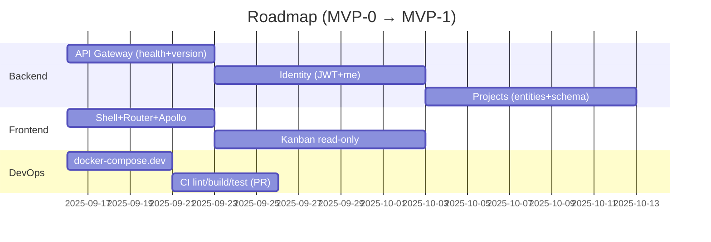

# SCRUM Project Manager

## Enterprise SCRUM Project Management Platform with AI Assistant

[](https://opensource.org/licenses/MIT)
[](https://angular.io/)
[](https://nestjs.com/)
[](https://graphql.org/)
[](https://www.typescriptlang.org/)

## Table of Contents

- [Overview](#overview)
- [Project Status](#project-status)
- [Roadmap]( 3roadmap)
- [Features](#features)
- [Architecture](#architecture)
- [Technology Stack](#technology-stack)
- [Project Structure](#project-structure)
- [Project Status](#project-status)
- [Roadmap]( 3roadmap)
- [Getting Started](#getting-started)
- [Development](#development)
- [Testing](#testing)
- [Documentation](#documentation)
- [Deployment](#deployment)
- [Contributing](#contributing)
- [License](#license)
- [Support](#support)

## Overview

A comprehensive SCRUM project management platform built with modern technologies, featuring AI-powered assistance, real-time collaboration, and enterprise-grade security. The platform follows agile methodologies and provides teams with powerful tools to manage projects, sprints, and tasks efficiently.

---

## Project Status

### Current State vs Scope

| Area     | Module/Feature         | Current State | Next Milestone                         | ETA     | Owner |
| -------- | ---------------------- | ------------- | -------------------------------------- | ------- | ----- |
| Backend  | API Gateway (GraphQL)  | Planned       | Healthcheck + `Query{version}`         | 1 week  | JR    |
| Backend  | Identity (JWT/RBAC)    | Design        | Login + Refresh + `me`                 | 3 weeks | JR    |
| Backend  | Projects               | Design        | Entities + Schema (`Project{id,name}`) | 4 weeks | JR    |
| Backend  | AI Assistant           | Planned       | `/recommendations` mock                | 4 weeks | JR    |
| Frontend | Shell + Router         | ✅ Done        | Kanban (read-only)                     | 2 weeks | —     |
| DevOps   | docker-compose.dev     | Design        | Postgres + Redis + services            | 2 weeks | —     |
| DevOps   | CI/CD (GitHub Actions) | Planned       | Lint + Build + Test on PRs             | 2 weeks | —     |
| Docs     | Compodoc               | ✅ Done        | Link from README                       | 1 day   | —     |

### Milestone Checklist

**MVP-0 (First tangible demo)**

* [ ] API Gateway: `GET /health`, `Query{version}`
* [ ] Identity: Login, Refresh, `me` resolver, basic guards
* [ ] Projects: TypeORM + migrations + `Project{id,name}` schema
* [ ] Frontend: Kanban (read-only) with Apollo
* [ ] docker-compose.dev: Postgres + Redis + services
* [ ] E2E test: create project → see it in Kanban

### Status Legend

* **Planned**: Mentioned in scope, not yet started
* **Design**: Domain model / architecture defined
* **Scaffolded**: Nx app/library generated, minimal code present
* **In Progress**: Active implementation
* **Done**: Ready and working with tests/docs

## Roadmap



## Risks & Assumptions

* **Risk**: Premature microservice split → **Mitigation**: start as modular monolith, extract later.
* **Risk**: Scope creep → **Mitigation**: enforce milestone boundaries.
* **Assumption**: Postgres + Redis available via docker-compose.dev.

## Definition of Done (per layer)

* **Backend**: Compiles, GraphQL schema generated, minimal unit tests.
* **Frontend**: Builds, routed module loads, basic store integration.
* **DevOps**: `docker compose up` runs frontend + backend + db + redis.
* **Docs**: Updated README, STATUS.md, Compodoc builds without errors.

---

## Features

### Core Features

- **Project Dashboard**: Visual metrics and KPIs for real-time project tracking
- **Sprint Management**: Comprehensive sprint planning, tracking, and retrospective tools
- **Task Management**: Interactive Kanban board with drag-and-drop functionality
- **Team Collaboration**: Threaded discussions, mentions, and real-time updates
- **Notifications System**: Multi-channel notifications (email, push, in-app)
- **User Experience**: Dark/Light mode with customizable themes
- **Internationalization**: Full i18n support for global teams
- **Access Control**: Granular Role-Based Access Control (RBAC)

### AI-Powered Features

- **Intelligent Assistant**: ChatGPT-5 integration for context-aware assistance
- **Smart Suggestions**: Proactive recommendations for process improvement
- **Deep Analysis**: Advanced problem-solving with automatic prompt optimization
- **Action Automation**: AI-driven task creation and project management
- **Methodology Compliance**: Automated SCRUM best practices enforcement

### Technical Features

- **Security**: JWT-based authentication with refresh tokens
- **Authorization**: Fine-grained permission system
- **Real-time Communication**: WebSocket-based live updates
- **Scalability**: Microservices architecture for horizontal scaling
- **Performance**: Optimized for enterprise deployments
- **Monitoring**: Built-in metrics and health checks

## Architecture

```
┌──────────────────────────────────────────────────────────┐
│                    Frontend (Angular 20)                 │
│                   Material UI + SCSS + NgRx              │
└─────────────────────────────┬────────────────────────────┘
                              │
                              ▼
┌──────────────────────────────────────────────────────────┐
│              API Gateway (GraphQL + Apollo)              │
└──────────────┬──────────────┬──────────────┬─────────────┘
               │              │              │
               ▼              ▼              ▼
       ┌──────────────┐┌──────────────┐┌──────────────┐
       │   Identity   ││   Projects   ││ AI Assistant │
       │   Service    ││   Service    ││   Service    │
       │   (NestJS)   ││   (NestJS)   ││   (NestJS)   │
       └──────────────┘└──────────────┘└──────────────┘
               │              │              │
               └──────────────┼──────────────┘
                              │
                    ┌─────────┴──────────┐
                    │                    │
            ┌───────▼─────────┐ ┌────────▼───────┐
            │  PostgreSQL DB  │ │  Redis Cache   │
            └─────────────────┘ └────────────────┘
```

## Technology Stack

### Frontend
- **Framework**: Angular 20 with standalone components
- **UI Library**: Angular Material with custom theme
- **Styling**: SCSS with BEM methodology
- **State Management**: NgRx for predictable state
- **HTTP Client**: Apollo Client for GraphQL
- **Build Tool**: Nx for monorepo management

### Backend
- **Framework**: NestJS with TypeScript
- **API Layer**: GraphQL with Apollo Server
- **ORM**: TypeORM for database management
- **Database**: PostgreSQL 15+
- **Cache**: Redis for session and data caching
- **Authentication**: Passport with JWT strategy
- **Validation**: class-validator and class-transformer

### DevOps & Infrastructure
- **Containerization**: Docker and Docker Compose
- **Orchestration**: Kubernetes ready
- **CI/CD**: GitHub Actions workflows
- **Monitoring**: Prometheus and Grafana
- **Documentation**: Compodoc for code documentation
- **Testing**: Jest, Karma, and Cypress

## Project Structure

```
scrum-project-manager/
├── apps/                        # Applications
│   ├── frontend/                # Angular application
│   ├── api-gateway/             # GraphQL API gateway
│   ├── identity-service/        # Authentication service
│   ├── projects-service/        # Projects management
│   └── ai-assistant-service/    # AI integration service
├── libs/                        # Shared libraries
│   ├── shared/
│   │   ├── interfaces/          # TypeScript interfaces
│   │   ├── utils/               # Utility functions
│   │   ├── constants/           # Application constants
│   │   ├── dto/                 # Data Transfer Objects
│   │   └── entities/            # Database entities
│   ├── frontend/
│   │   └── ui/                  # Shared UI components
│   └── backend/
│       └── common/              # Shared backend utilities
├── docs/                        # Documentation
├── scripts/                     # Utility scripts
├── postman/                     # API testing collections
└── nginx/                       # Web server configuration
```

---

## Project Status

### Current State vs Scope

| Area     | Module/Feature         | Current State | Next Milestone                         | ETA     | Owner |
| -------- | ---------------------- | ------------- | -------------------------------------- | ------- | ----- |
| Backend  | API Gateway (GraphQL)  | Planned       | Healthcheck + `Query{version}`         | 1 week  | JR    |
| Backend  | Identity (JWT/RBAC)    | Design        | Login + Refresh + `me`                 | 3 weeks | JR    |
| Backend  | Projects               | Design        | Entities + Schema (`Project{id,name}`) | 4 weeks | JR    |
| Backend  | AI Assistant           | Planned       | `/recommendations` mock                | 4 weeks | JR    |
| Frontend | Shell + Router         | ✅ Done        | Kanban (read-only)                     | 2 weeks | —     |
| DevOps   | docker-compose.dev     | Design        | Postgres + Redis + services            | 2 weeks | —     |
| DevOps   | CI/CD (GitHub Actions) | Planned       | Lint + Build + Test on PRs             | 2 weeks | —     |
| Docs     | Compodoc               | ✅ Done        | Link from README                       | 1 day   | —     |

### Milestone Checklist

**MVP-0 (First tangible demo)**

* [ ] API Gateway: `GET /health`, `Query{version}`
* [ ] Identity: Login, Refresh, `me` resolver, basic guards
* [ ] Projects: TypeORM + migrations + `Project{id,name}` schema
* [ ] Frontend: Kanban (read-only) with Apollo
* [ ] docker-compose.dev: Postgres + Redis + services
* [ ] E2E test: create project → see it in Kanban

### Status Legend

* **Planned**: Mentioned in scope, not yet started
* **Design**: Domain model / architecture defined
* **Scaffolded**: Nx app/library generated, minimal code present
* **In Progress**: Active implementation
* **Done**: Ready and working with tests/docs

## Roadmap


## Risks & Assumptions

* **Risk**: Premature microservice split → **Mitigation**: start as modular monolith, extract later.
* **Risk**: Scope creep → **Mitigation**: enforce milestone boundaries.
* **Assumption**: Postgres + Redis available via docker-compose.dev.

## Definition of Done (per layer)

* **Backend**: Compiles, GraphQL schema generated, minimal unit tests.
* **Frontend**: Builds, routed module loads, basic store integration.
* **DevOps**: `docker compose up` runs frontend + backend + db + redis.
* **Docs**: Updated README, STATUS.md, Compodoc builds without errors.

---

## Getting Started

### Prerequisites

- Node.js >= 20.0.0
- npm >= 10.0.0
- Docker >= 24.0.0
- Docker Compose >= 2.0.0
- PostgreSQL >= 15.0 (optional for local development)
- Redis >= 7.0 (optional for local development)

### Installation

1. **Clone the repository**
   ```bash
   git clone https://github.com/Yoshikemolo/scrum-project-manager.git
   cd scrum-project-manager
   ```

2. **Install dependencies**
   ```bash
   npm install
   ```

3. **Configure environment**
   ```bash
   cp .env.example .env
   # Edit .env with your configuration
   ```

4. **Start Docker services**
   ```bash
   docker-compose up -d
   ```

5. **Run database migrations**
   ```bash
   npm run migration:run
   ```

6. **Start development servers**
   ```bash
   npm run dev
   ```

The application will be available at:
- Frontend: http://localhost:4200
- API Gateway: http://localhost:3000/graphql
- API Documentation: http://localhost:3000/api-docs

## Development

### Development Commands

```bash
# Start all services in development mode
npm run dev

# Start specific services
npm run dev:frontend          # Frontend only
npm run dev:backend           # All backend services
npm run dev:api-gateway       # API Gateway only

# Code generation
nx g component my-component --project=frontend
nx g service my-service --project=api-gateway

# Linting and formatting
npm run lint                  # Lint all projects
npm run format                # Format code with Prettier

# Database operations
npm run migration:generate    # Generate new migration
npm run migration:run         # Run pending migrations
npm run migration:revert      # Revert last migration
```

### Environment Variables

See `.env.example` for all available configuration options. Key variables include:

- `NODE_ENV`: Environment (development/production)
- `DATABASE_*`: PostgreSQL connection settings
- `REDIS_*`: Redis connection settings
- `JWT_*`: Authentication configuration
- `OPENAI_API_KEY`: AI integration key

## Testing

```bash
# Unit tests
npm run test                 # Run all unit tests
npm run test:watch           # Watch mode
npm run test:cov             # Generate coverage report

# Integration tests
npm run test:integration      # Run integration tests

# End-to-end tests
npm run test:e2e             # Run E2E tests
npm run test:e2e:watch       # E2E in watch mode

# Specific project tests
nx test frontend             # Test frontend
nx test api-gateway          # Test API gateway
```

## Documentation

### Available Documentation

Comprehensive documentation is available in the `/docs` directory:

- [Documentation Index](./docs/README.md) - Complete documentation overview
- [Architecture Overview](./docs/ARCHITECTURE.md) - System design and patterns
- [API Documentation](./docs/API.md) - GraphQL schema and endpoints
- [Development Guide](./docs/DEVELOPMENT.md) - Development workflow and standards
- [Testing Guide](./docs/TESTING.md) - Testing strategy and practices
- [Deployment Guide](./docs/DEPLOYMENT.md) - Production deployment instructions
- [Security Guide](./docs/SECURITY.md) - Security measures and best practices
- [AI Integration Guide](./docs/AI_INTEGRATION.md) - AI assistant configuration
- [Contributing Guide](./docs/CONTRIBUTING.md) - Contribution guidelines
- [Project Dependencies](./docs/PROJECT_DEPENDENCIES.md) - External dependencies explanation

### Code Documentation

Generate and serve code documentation using Compodoc:

```bash
# Generate documentation
npm run docs:generate

# Serve documentation locally
npm run docs:serve

# Generate for specific project
npx compodoc -p apps/frontend/tsconfig.app.json -d dist/docs/frontend
```

## Deployment

### Docker Deployment

```bash
# Development environment
docker-compose up -d

# Production environment
docker-compose -f docker-compose.prod.yml up -d

# View logs
docker-compose logs -f

# Stop services
docker-compose down
```

### Kubernetes Deployment

```bash
# Apply configurations
kubectl apply -f k8s/

# Check deployment status
kubectl get pods -n scrum-pm

# Scale deployment
kubectl scale deployment api-gateway --replicas=3 -n scrum-pm
```

### Production Build

```bash
# Build all applications
npm run build:prod

# Build specific application
nx build frontend --configuration=production
```

## Contributing

We welcome contributions! Please see our [Contributing Guide](./docs/CONTRIBUTING.md) for details on:

- Code of conduct
- Development process
- Coding standards
- Pull request process
- Testing requirements

## License

This project is licensed under the MIT License - see the [LICENSE](LICENSE) file for details.

## Support

- **Documentation**: [Project Wiki](https://github.com/Yoshikemolo/scrum-project-manager/wiki)
- **Issues**: [GitHub Issues](https://github.com/Yoshikemolo/scrum-project-manager/issues)
- **Email**: support@ximplicity.es
- **Website**: [Ximplicity](https://ximplicity.es)

## Acknowledgments

- Built with excellence by [Ximplicity Software Solutions](https://ximplicity.es)
- Powered by cutting-edge open-source technologies
- AI capabilities provided by OpenAI's GPT-5

---

Copyright © 2025 Ximplicity Software Solutions. All Rights Reserved.
